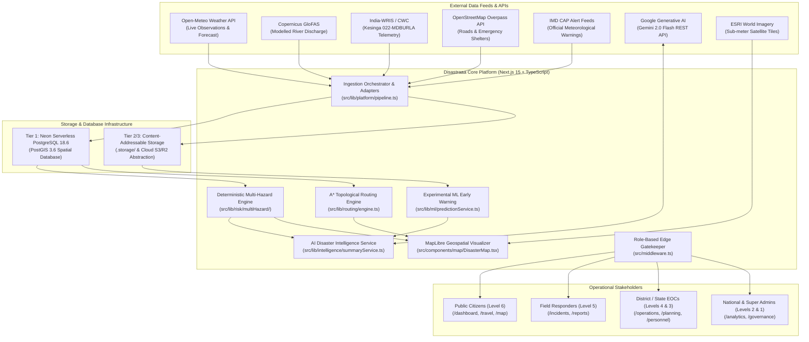
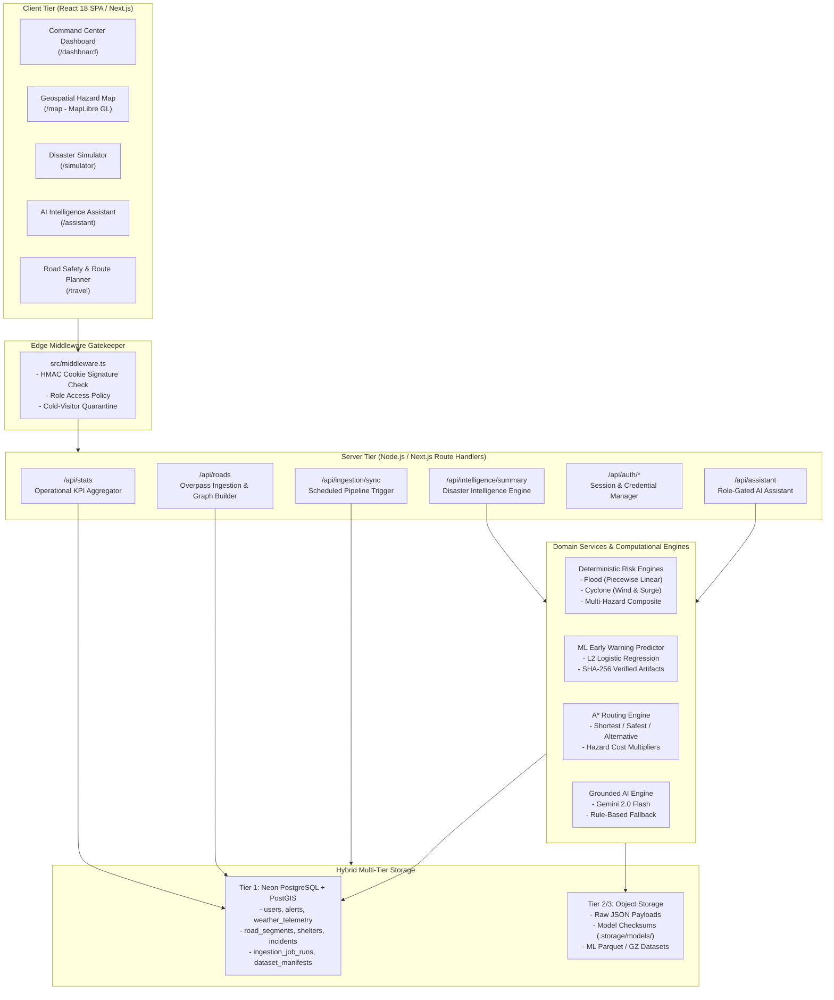
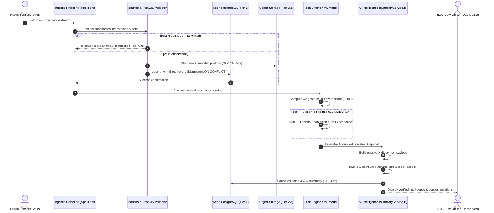
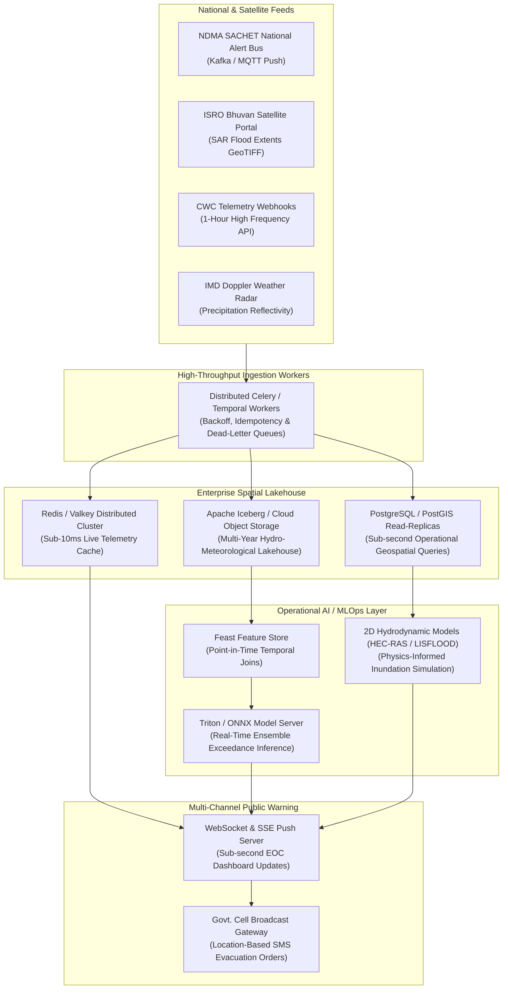

# DISASTRAAA — SYSTEM ARCHITECTURE SPECIFICATION

**Document Version:** 1.0.0 (Production Audit)  
**Date:** October 9, 2026  
**Status:** Verified Against Active Codebase  
**Auditor:** Senior Software Architect & Geospatial Systems Engineer  

---

## 1. HIGH-LEVEL SYSTEM CONTEXT

Disastraaa is an intelligent, multi-hazard disaster decision-support system built for emergency operations centers (EOCs), administrative authorities, field responders, and citizens across India (with deep operational calibration for the coastal and riverine Odisha basin).

### Verified System Boundary:


---

## 2. VERIFIED CURRENT ARCHITECTURE

The active implementation combines Next.js App Router server endpoints, client-side MapLibre visualizations, an Edge security middleware gate, and a three-tier storage engine:



---

## 3. COMPONENT & REPOSITORY LAYER SPECIFICATION

```
src/
├── app/                          # Next.js 15 App Router Routes (48 compiled pages)
│   ├── (dashboard)/              # Authority-Gated Operational Views
│   │   ├── analytics/            # National Hazard Overview (Level 2)
│   │   ├── assistant/            # Dedicated AI Assistant Interface
│   │   ├── dashboard/            # Multi-Hazard Command Center (Level 4/3)
│   │   ├── evacuation/           # Evacuation Operations Management
│   │   ├── governance/           # Super Admin Audit & System Logs (Level 1)
│   │   ├── historical/           # Disaster Archives & Trends
│   │   ├── incidents/            # Emergency Incident Management
│   │   ├── operations/           # Live EOC Dispatch & Task Force Tracking
│   │   ├── personnel/            # Departmental User Management & Invites
│   │   ├── planning/             # Resource Allocation & Preparedness
│   │   ├── reports/manage/       # Citizen Report Verification Workflow
│   │   ├── resources/            # Inventory & Emergency Supply Tracking
│   │   ├── settings/             # System Profile & API Configuration
│   │   ├── simulator/            # Multi-Hazard Scenario Simulator
│   │   └── state/                # State Authority Aggregations (Level 3)
│   ├── (public)/                 # Public Citizen & Open Access Routes
│   │   ├── alerts/               # Authoritative Broadcast Warnings
│   │   ├── map/                  # Full-Screen Interactive GIS Map
│   │   ├── reports/              # Citizen Report Submission Portal
│   │   ├── shelters/             # Emergency Shelter Finder & Capacities
│   │   └── travel/               # Road Safety & Evacuation Route Planner
│   └── api/                      # REST API Endpoints (Role-Gated & Authenticated)
├── components/                   # Modular UI Component Library
│   ├── demo/                     # REAL vs DEMO Isolation Badges & Persona Switchers
│   ├── evacuation/               # Evacuation Zone Cards & Shelter Allocations
│   ├── map/                      # MapLibre GL Wrappers, Basemap & Layer Controls
│   ├── operations/               # Command Center Tactical Cards & KPI Grids
│   ├── reports/                  # Citizen Report Forms & Verification Badges
│   └── routing/                  # Route Planner Forms, Elevation & Hazard Diffs
├── config/                       # Nav Menus, Basemap Tile Definitions, System Constants
├── data/                         # Hardcoded Prototype Fixtures & Demo Datasets (Isolated)
├── lib/                          # Core Domain Logic & Systems Engineering
│   ├── ai/                       # Gemini 2.0 Flash Client, Prompts, Sanitize & Intent Detection
│   ├── alerts/                   # Alert Processing, IMD CAP Parsers & Storage
│   ├── auth/                     # Scrypt Password Hashing, HMAC Sessions, Role Policy
│   ├── db/                       # Neon Serverless Client, SQL Schema & PostGIS Migrations
│   ├── geo/                      # Coordinate Transforms, Haversine, Bounding Box Guards
│   ├── hydrology/                # CWC India-WRIS Client & GloFAS Flood Ingestion
│   ├── intelligence/             # Grounded Snapshot Builder & AI Summary Service
│   ├── ml/                       # Features, Scaler, Models, Evaluator, Registry, Predictor
│   ├── platform/                 # Reusable Ingestion Pipeline, Registry, Retention, Storage
│   ├── risk/                     # Deterministic Flood, Cyclone, Multi-Hazard & Journey Engines
│   ├── roads/                    # OSM Road Store, Overpass Ingestion, Travel Risk Scoring
│   ├── routing/                  # Deterministic A* Graph Search & Multi-Path Cost Evaluators
│   ├── shelters/                 # Shelter Store, Capacity Tracking & Overpass Ingestion
│   └── weather/                  # Open-Meteo Normalized Weather Provider & Neon Store
└── types/                        # Enterprise TypeScript Domain Contracts
```

---

## 4. END-TO-END DATA PROCESSING PIPELINE



---

## 5. PROPOSED FUTURE PRODUCTION ARCHITECTURE

To transition Disastraaa from a hackathon prototype to an enterprise-grade statutory disaster operations platform, the following target architecture is proposed:


